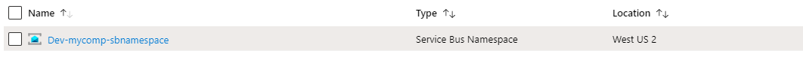

# Terraform Provider for Azure (Resource Manager)

The Terraform  Provider for Azure Service Bus with Queue and Topic

```resource "azurerm_resource_group" "example" {
  name     = "${var.prefix}-resources"
  location = "${var.location}"
}

resource "azurerm_servicebus_namespace" "example" {
  name                = "${var.prefix}-sbnamespace"
  location            = "${azurerm_resource_group.example.location}"
  resource_group_name = "${azurerm_resource_group.example.name}"
  sku                 = "Standard"
}

resource "azurerm_servicebus_namespace_authorization_rule" "example" {
  name                = "${var.prefix}-sbnauth"
  namespace_name      = "${azurerm_servicebus_namespace.example.name}"
  resource_group_name = "${azurerm_resource_group.example.name}"
  send                = true
  listen              = true
  manage              = true
}

resource "azurerm_servicebus_topic" "example" {
  name                = "${var.prefix}-sbtopic"
  resource_group_name = "${azurerm_resource_group.example.name}"
  namespace_name      = "${azurerm_servicebus_namespace.example.name}"
  enable_partitioning = true
}

resource "azurerm_servicebus_subscription" "example" {
  name                = "${var.prefix}-sbsubscription"
  resource_group_name = "${azurerm_resource_group.example.name}"
  namespace_name      = "${azurerm_servicebus_namespace.example.name}"
  topic_name          = "${azurerm_servicebus_topic.example.name}"
  max_delivery_count  = 1
}

resource "azurerm_servicebus_queue" "example" {
  name                = "${var.prefix}-sbqueue"
  resource_group_name = "${azurerm_resource_group.example.name}"
  namespace_name      = "${azurerm_servicebus_namespace.example.name}"
  enable_partitioning = true
}
```

# How to Run Sample

```
Terraform init
Terraform plan
Terraform apply

```

# Deploy Azure Service Bus


